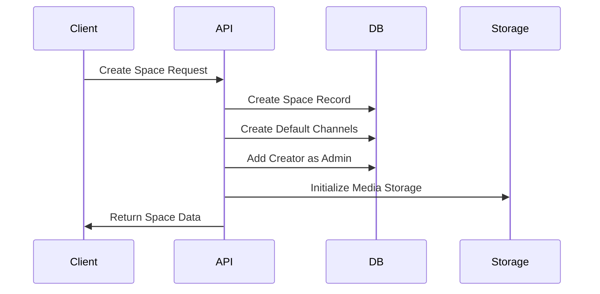
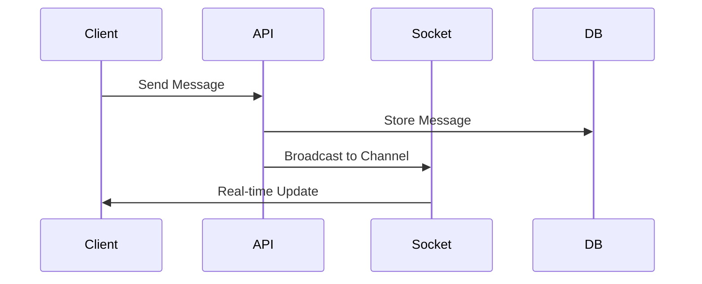

# FolioMark5 Architecture Blueprint

## 🎯 Core Architecture Principles

### 1. Utility Organization

- **Location**: `src/lib/utils.ts`
- **Rule**: All shared utilities MUST be placed here
- **No Creating New Utility Files** - Instead:
  ```typescript
  // src/lib/utils.ts
  export const utils = {
    // Format functions
    format: {
      date: (date: Date) => {
        /* ... */
      },
      currency: (amount: number) => {
        /* ... */
      },
      fileSize: (bytes: number) => {
        /* ... */
      },
    },
    // Validation functions
    validate: {
      email: (email: string) => {
        /* ... */
      },
      password: (password: string) => {
        /* ... */
      },
    },
    // HTTP helpers
    http: {
      handleApiError: (error: unknown) => {
        /* ... */
      },
      createQueryString: (params: Record<string, string>) => {
        /* ... */
      },
    },
  }
  ```

### 2. Component Architecture

#### Base Components (`src/components/ui/`)

```typescript
// Button example demonstrating proper composition
export interface ButtonProps extends React.ButtonHTMLAttributes<HTMLButtonElement> {
  variant?: 'default' | 'destructive' | 'outline' | 'ghost' | 'link'
  size?: 'default' | 'sm' | 'lg' | 'icon'
}

// All base components should follow shadcn/ui patterns
import { Button } from '@/components/ui/button'
import { Input } from '@/components/ui/input'
import { Card } from '@/components/ui/card'
```

#### Feature Components (`src/components/spaces/`)

- **Rule**: One folder per feature
- **Structure**:
  ```
  spaces/
  ├── space/
  │   ├── space-header.tsx    # Header component
  │   ├── space-sidebar.tsx   # Sidebar navigation
  │   └── space-layout.tsx    # Layout wrapper
  ├── chat/
  │   ├── chat-messages.tsx   # Message display
  │   └── chat-input.tsx      # Message input
  └── shared/
      └── space-loader.tsx    # Shared loading states
  ```

### 3. State Management Patterns

#### Server State

```typescript
// src/hooks/use-chat-query.ts
export const useChatQuery = (channelId: string) => {
  return useQuery({
    queryKey: ['chat', channelId],
    queryFn: () => fetchMessages(channelId),
  })
}
```

#### Client State

```typescript
// src/store/use-modal-store.ts
export const useModal = create<ModalStore>((set) => ({
  type: null,
  data: {},
  isOpen: false,
  onOpen: (type, data = {}) => set({ isOpen: true, type, data }),
  onClose: () => set({ type: null, isOpen: false, data: {} }),
}))
```

### 4. API Architecture

#### Route Handlers (`src/app/api/`)

```typescript
// src/app/api/spaces/[spaceId]/route.ts
import { auth } from '@/lib/auth'
import { db } from '@/lib/db'

export async function GET(req: Request, { params }: { params: { spaceId: string } }) {
  try {
    const session = await auth()
    if (!session) return new Response('Unauthorized', { status: 401 })

    const space = await db.space.findUnique({
      where: { id: params.spaceId },
    })

    return Response.json(space)
  } catch (error) {
    return new Response('Internal Error', { status: 500 })
  }
}
```

### 5. Database Schema Patterns

#### Collection Organization

```typescript
// src/collections/spaces.ts
import { CollectionConfig } from 'payload/types'

export const Spaces: CollectionConfig = {
  slug: 'spaces',
  auth: false,
  admin: {
    useAsTitle: 'name',
    defaultColumns: ['name', 'createdAt'],
  },
  fields: [
    {
      name: 'name',
      type: 'text',
      required: true,
    },
    {
      name: 'members',
      type: 'relationship',
      relationTo: 'members',
      hasMany: true,
    },
  ],
}
```

### 6. Auth Pattern Implementation

```typescript
// src/lib/auth.ts
import { getServerSession } from 'next-auth'
import { db } from '@/lib/db'

export const auth = async () => {
  const session = await getServerSession()
  if (!session?.user?.email) return null

  return session
}

export const currentProfile = async () => {
  const session = await auth()
  if (!session) return null

  const profile = await db.profile.findUnique({
    where: { userId: session.user.id },
  })

  return profile
}
```

### 7. Socket/Real-time Implementation

```typescript
// src/components/providers/socket-provider.tsx
import { createContext, useContext, useEffect, useState } from "react"
import { io as ClientIO } from "socket.io-client"

const SocketContext = createContext({})

export const SocketProvider = ({ children }: { children: React.ReactNode }) => {
  const [socket, setSocket] = useState(null)

  useEffect(() => {
    const socketInstance = ClientIO(process.env.NEXT_PUBLIC_SITE_URL!, {
      path: "/api/socket/io",
      addTrailingSlash: false,
    })

    setSocket(socketInstance)
    return () => {
      socketInstance.disconnect()
    }
  }, [])

  return (
    <SocketContext.Provider value={{ socket }}>
      {children}
    </SocketContext.Provider>
  )
}
```

### 8. Error Handling Pattern

```typescript
// src/lib/exceptions.ts
export class ApiError extends Error {
  constructor(
    public statusCode: number,
    message: string,
    public code?: string,
  ) {
    super(message)
    this.name = 'ApiError'
  }
}

// Usage in API routes
if (!space) {
  throw new ApiError(404, 'Space not found', 'SPACE_NOT_FOUND')
}
```

## 📊 Data Flow Guidelines

### 1. Space Creation Flow



### 2. Message Flow



## 🔍 Type Safety Checklist

- [ ] Collection types generated from Payload
- [ ] API response types defined
- [ ] Component props strictly typed
- [ ] Utility functions fully typed
- [ ] Socket events typed
- [ ] State management typed

## 🧪 Testing Requirements

### Unit Tests

- Components using React Testing Library
- Utility functions
- API handlers
- State management

### Integration Tests

- Authentication flows
- Space operations
- Real-time messaging
- Media handling

### E2E Tests

- User journeys
- Critical paths
- Error scenarios

## 🚨 Common Anti-patterns to Avoid

1. **❌ Don't**: Create new utility files
   ✅ **Do**: Add to existing `src/lib/utils.ts`

2. **❌ Don't**: Duplicate components
   ✅ **Do**: Compose from base components

3. **❌ Don't**: Mix client/server state
   ✅ **Do**: Use appropriate hooks/stores

4. **❌ Don't**: Inline API calls
   ✅ **Do**: Use server actions or API routes

5. **❌ Don't**: Custom styling
   ✅ **Do**: Use Tailwind utilities

## 📚 Dependencies & Libraries

### Core Dependencies

- `payload` - CMS functionality
- `next` - Framework
- `react` - UI library
- `socket.io` - Real-time features
- `mongodb` - Database

### UI Dependencies

- `tailwindcss` - Styling
- `shadcn/ui` - Component library
- `lucide-react` - Icons

### State Management

- `zustand` - Client state
- `@tanstack/react-query` - Server state

### Real-time

- `livekit-client` - Video/audio
- `socket.io-client` - WebSocket

## 🔄 Upgrade Guidelines

1. Check dependency compatibility
2. Review breaking changes
3. Update types
4. Test critical paths
5. Update documentation

## 📈 Performance Guidelines

1. Use React.memo() sparingly
2. Implement proper pagination
3. Optimize media assets
4. Cache API responses
5. Lazy load components

Remember: This architecture is designed to scale. Always consider the impact of changes on the broader system.
